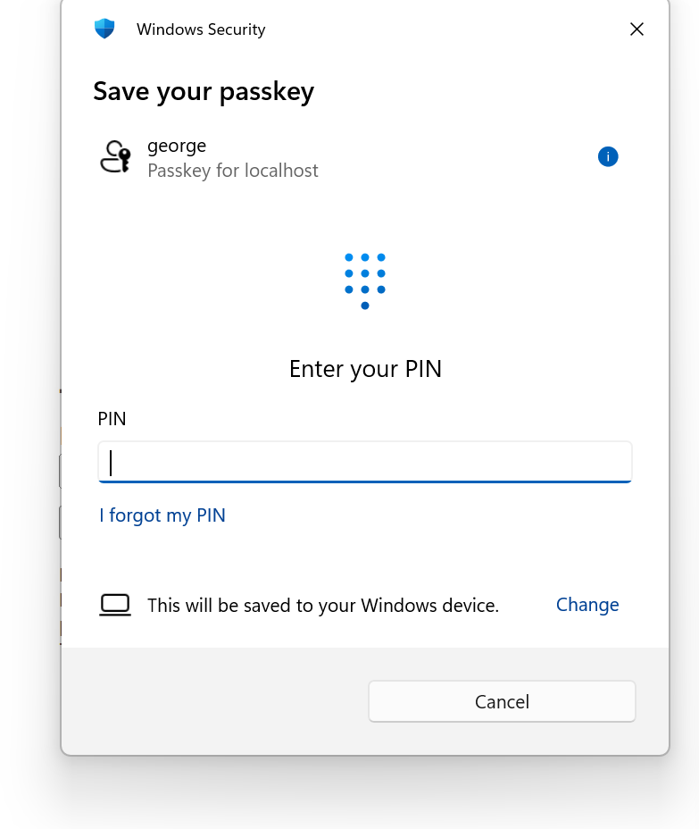
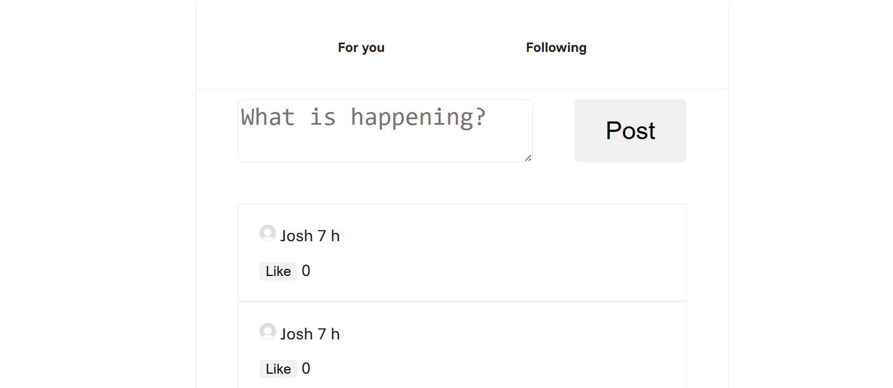
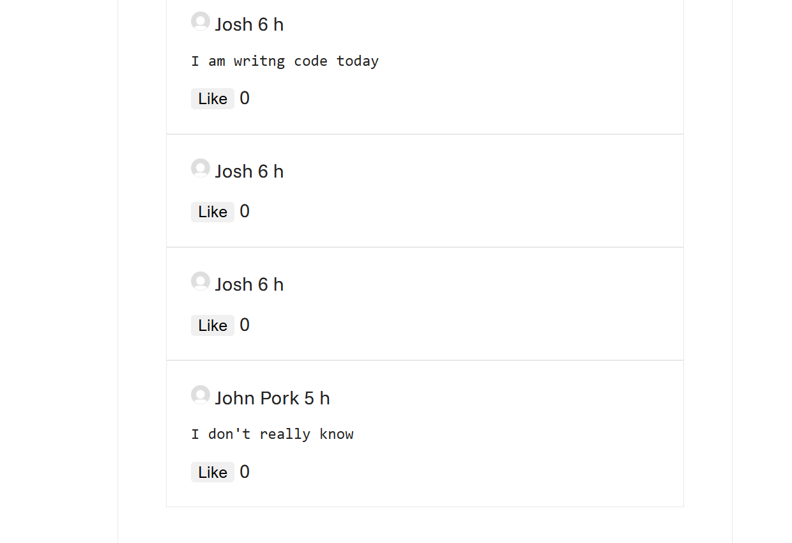

# X app

Recreating the basic X app.

## What features

- Login / sign up page
- Account and sessions
- Post with likes and unliking
- Only the creator can delete the post.
- Passkeys login and sign up

## Screen shots

Authentication page
<br> 

Passkeys
<br> 

Home page
<br> 


## Requirements

- Install deno run `irm https://deno.land/install.ps1` | iex (for windows)

## How to run

- run `deno task start`
- Open browser enter this `http://localhost:8000/`

## Stack / tools used

- sqlite database
- HTMX
- Deno
- JS

## Project structure

```txt
├── deno.json
├── deno.lock
├── README.md
│
├── .vscode
│    └── settings.json
│
├── data
│   └── database.db
│
└── src
    ├── server.js
    │
    ├── webauthn
    │   ├── authentication
    │   │   ├── get-options.js
    │   │   └── verify-response.js
    │   │   
    │   ├── registration
    │   │   ├── create-options.js
    │   │   └── verify-response.js
    │   │       
    │   └── sessions.js
    │       └── session.js
    │
    ├── data-base
    │   ├── account-challenge.js   
    │   ├── likes.js
    │   ├── passkeys.js    
    │   ├── posts.js
    │   ├── table.js
    │   └── users.js
    │
    ├── handlers
    │   ├── authentication.js    
    │   ├── delete-post.js
    │   ├── get-posts.js
    │   ├── like-unlike.js
    │   ├── post.js
    │   └── registration.js
    │
    ├── helper-functions
    │   ├── json-response.js   
    │   ├── html-response.js
    │   └── get-time.js
    │
    ├── public
    │   ├── authentication.js
    │   ├── registration.js        
    │   ├── index.html
    │   │
    │   └── assets     
    │       └── profile-pic.png
    │ 
    ├── view
    │   ├── likes.js
    │   ├── list.js   
    │   └── post-template.js
    │
    ├── routes
    │   └── table.js
    │
    └── view
```

## Key logic

**Common flow**

- HTMX request → server routing → handler → database → HTML response.

**authentication and registration**

- User enters username and presses login
- Server checks if account exists in database
- If valid, authentication step begins
- User enters PIN
- Credentials are verified
- On success, user is logged in and a new session is created

**new post**

- User enters post content
- Post is created and stored in the database
- Post includes username, content, and likes
- New post is added to the UI post list

**like post**

- User presses like on a post
- Server finds post by ID in database
- Like count is incremented by one
- New value and unlike button return to UI

**delete post**

- Delete button is only visible to the post creator
- User presses delete
- Post is located and removed from the database
- Post HTML is removed from the UI

## known promblems

- Likes aren’t tied to accounts, so refreshing allows repeated likes.
- passkeys take a long time
- Lacks a lot of features
- for you and following are just looks not function
